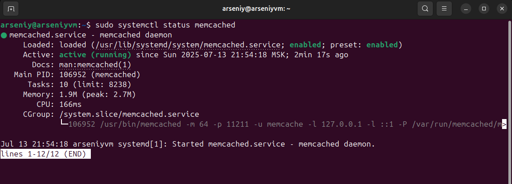
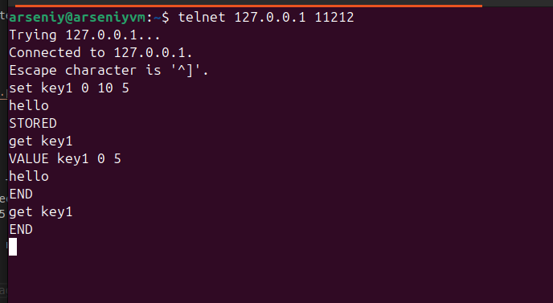
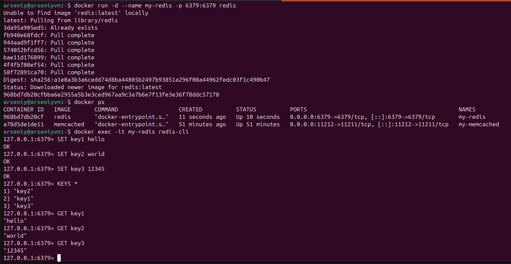
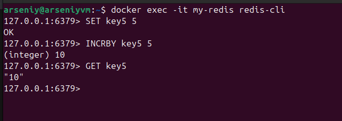

# Домашнее задание к занятию   
**"`Базы данных, их типы`"** - `Воскобойников Арсений Петрович`  
   
**Задание 1**  
``` 
Задание 1. Кеширование
Приведите примеры проблем, которые может решить кеширование.  
Приведите ответ в свободной форме.

``` 
**Ответ**  
Повышение производительности достигается за счет
складывания в кэш данных, к которым чаще всего происходит
обращение;
Увеличение скорости ответа;
Экономия ресурсов базы данных, например, применяя
кэширование тяжелых запросов;
Сглаживание бустов трафика. Например, во время черной
пятницы онлайн-магазины используют кэш, чтобы переживать
резкое увеличение трафика. 

**Задание 2**   

```
Задание 2. Memcached
Установите и запустите memcached.

Приведите скриншот systemctl status memcached, где будет видно, что memcached запущен.

``` 
**Ответ:**    



**Задание 3**  

```
Задание 3. Удаление по TTL в Memcached
Запишите в memcached несколько ключей с любыми именами и значениями, для которых выставлен TTL 5.

Приведите скриншот, на котором видно, что спустя 5 секунд ключи удалились из базы.

```

**Ответ:**  

Запустим memcahed в Docker контейнере на порту 11212 (запустил специально на отдельном порту, что бы разделить с локальной службой).  
Запишем значение для key1 (5 секунд заменил на 10 потому что при 5 не видел значение записанное в базу, со значением 10 таких проблем не возникло)



Ждём 10 секунд и при повторном выводе значения видим, что оно удалилось.  

**Задание 4**  

```
Запишите в Redis несколько ключей с любыми именами и значениями.

Через redis-cli достаньте все записанные ключи и значения из базы, приведите скриншот этой операции.

```

**Ответ**  

Запустим Redis в контейнере.
Сделаем запись 3 ключей
  
Получим список всех клчюей.
Получим значение этих ключей.


**Задание 5**  

```
Задание 5*. Работа с числами
Запишите в Redis ключ key5 со значением типа "int" равным числу 5. Увеличьте его на 5, чтобы в итоге в значении лежало число 10.

Приведите скриншот, где будут проделаны все операции и будет видно, что значение key5 стало равно 10.

```
**Ответ**  

Запустим Redis в контейнере.  
Сделаем запись ключа 5
Увеличим значение ключа на 5
   
Проверим получившиеся значение ключа.

